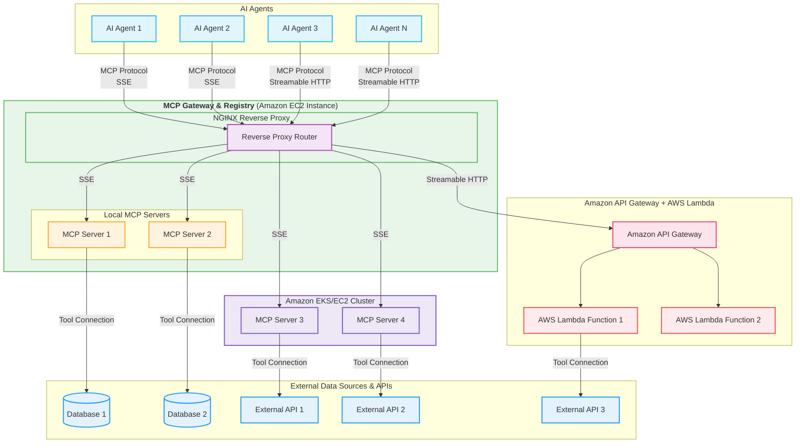

# ⚠️ ACTIVE DEVELOPMENT - WORK IN PROGRESS ⚠️

> **WARNING**: This repository is under active development. Expect frequent updates and breaking changes as we improve functionality and refine APIs. We recommend pinning to specific versions for production use. Star the repository to track our progress!


# MCP Gateway & Registry

[Model Context Protocol (MCP)](https://modelcontextprotocol.io/introduction) is an open standard protocol that allows AI Models to connect with external systems, tools, and data sources. A common problem that enterprises face while using MCP servers is that there is a need for a central point of access to a curated list of MCP servers and a catalog of such servers. This is the precise problem that this application provides a solution for by implementing an **MCP Gateway & Registry**. 


## Architecture

The Gateway works by using an [Nginx server](https://docs.nginx.com/nginx/admin-guide/web-server/reverse-proxy/) as a reverse proxy, where each MCP server is handled as a different _path_ and the Nginx reverse proxy sitting between the MCP clients (contained in AI Agents for example) and backend server forwards client requests to appropriate backend servers and returns the responses back to clients. The requested resources are then returned to the client.

The MCP Gateway provides a single endpoint to access multiple MCP servers and the Registry provides discoverability and management functionality for the MCP servers that an enterprise wants to use. An AI Agent written in any framework can connect to multiple MCP servers via this gateway, for example to access two MCP servers one called `weather`,  and another one called `currenttime` and agent would create an MCP client pointing `https://my-mcp-gateway.enterprise.net/weather/` and another one pointing to `https://my-mcp-gateway.enterprise.net/currenttime/`.  **This technique is able to support both SSE and Streamable HTTP transports**. 



## Features

*   **Service Registration:** Register MCP services via JSON files or the web UI/API.
*   **Web UI:** Manage services, view status, and monitor health through a web interface.
*   **Authentication:** Secure login system for the web UI and API access.
*   **Health Checks:**
    *   Periodic background checks for enabled services (checks `/sse` endpoint).
    *   Manual refresh trigger via UI button or API endpoint.
*   **Real-time UI Updates:** Uses WebSockets to push health status, tool counts, and last-checked times to all connected clients.
*   **Dynamic Nginx Configuration:** Generates an Nginx reverse proxy configuration file (`registry/nginx_mcp_revproxy.conf`) based on registered services and their enabled/disabled state.
*   **MCP Tool Discovery:** Automatically fetches and displays the list of tools (name, description, schema) for healthy services using the MCP client library.
*   **Service Management:**
    *   Enable/Disable services directly from the UI.
    *   Edit service details (name, description, URL, tags, etc.).
*   **Filtering & Statistics:** Filter the service list in the UI (All, Enabled, Disabled, Issues) and view basic statistics.
*   **UI Customization:**
    *   Dark/Light theme toggle (persisted in local storage).
    *   Collapsible sidebar (state persisted in local storage).
*   **State Persistence:** Enabled/Disabled state is saved to `registry/server_state.json` (and ignored by Git).

## Prerequisites

*   Python 3.12+ (or compatible version supporting FastAPI and MCP Client)
*   [uv](https://github.com/astral-sh/uv) for package management.
*   Nginx installed (steps for [`Ubuntu`](https://ubuntu.com/tutorials/install-and-configure-nginx#1-overview)) and configured to use the generated configuration file.
*   **You definitely want to run your MCP Gateway and Registry over HTTPS**. Refer to [this guide](secure.md) for steps to install Nginx and secure with an SSL cert.
*   One of the example MCP servers packaged in this repo uses the [`Polygon`](https://polygon.io/stocks) API for stock ticker data. Get an API key from [here](https://polygon.io/dashboard/signup?redirect=%2Fdashboard%2Fkeys) and place it in `servers/fininfo/.env` as `POLYGON_API_KEY=your-polygon-key`. The server will still start without the API key but you will get a 401 Unauthorized error when using the tools provided by this server.

## Installation

1.  **Clone the repository:**
    ```bash
    git clone https://github.com/aarora79/mcp-gateway.git
    cd mcp-gateway
    ```

1.  **Create and activate a virtual environment:**
    *   Using `uv`:
        ```bash
        uv venv --python 3.12 && source .venv/bin/activate && uv pip install --requirement pyproject.toml
        ```

1. **Start the example MCP servers packaged with this repo:**
    This command will start all packaged example MCP servers as background processes. Each server uses SSE transport and uses ports 8001, 8002 and so on so forth.
    ```bash
    ./start_all_servers.sh
    ```

    You should see logs similar to the following printed out on the Terminal.
    ```bash
    ubuntu@ip-172-31-79-166:~/repos/mcp-gateway$ ./start_all_servers.sh 
    Processing directory: servers/current_time (port: 8001)
    Setting up Python environment...
    Using CPython 3.12.3 interpreter at: /usr/bin/python3.12
    Creating virtual environment at: .venv
    Activate with: source .venv/bin/activate
    Installing requirements...
    Resolved 24 packages in 22ms
    Installed 24 packages in 8ms
    ...
    Starting server on port 8001...
    Server started with PID: 157360
    -----------------------------------
    Processing directory: servers/fininfo (port: 8002)
    Setting up Python environment...
    Using CPython 3.12.3 interpreter at: /usr/bin/python3.12
    Creating virtual environment at: .venv
    Activate with: source .venv/bin/activate
    ...
    Starting server on port 8002...
    Server started with PID: 157397
    -----------------------------------
    All servers have been started.
    To stop the servers, use: kill $(ps aux | grep 'python server.py' | grep -v grep | awk '{print $2}')
    ubuntu@ip-172-31-79-166:~/repos/mcp-gateway$ Uninstalled 3 packages in 3ms
    Installed 3 packages in 5ms
    INFO:     Started server process [157378]
    INFO:     Waiting for application startup.
    INFO:     Application startup complete.
    INFO:     Uvicorn running on http://0.0.0.0:8001 (Press CTRL+C to quit)
    INFO:     Started server process [157423]
    INFO:     Waiting for application startup.
    INFO:     Application startup complete.
    INFO:     Uvicorn running on http://0.0.0.0:8002 (Press CTRL+C to quit)
    ```


    If you need to stop all servers (say to restart them later), use the following command:
    ```bash
    kill $(ps aux | grep 'python server.py' | grep -v grep | awk '{print $2}')
    ```

1. **Start the MCP Registry:**

    1. Copy `.env.template` to `.env` and set the secret key, admin username and password in the `.env` file, see [configuration](#configuration).
    ```bash
    cp registry/env.template registry/.env
    ```

    1. Start the MCP Registry.
    ```bash
    uv run uvicorn registry.main:app --reload --host 0.0.0.0 --port 7860    
    ```

    You should be able to see the MCP Registry running on `http://localhost:7860` as shown in the following screenshot. You should be able to access the Registry over HTTPS as well using the domain name you configured for your server in the [prerequisites](#Prerequisites) section.

    


## Configuration

1.  **Environment Variables:** Create a `.env` file in the registry folder (`mcp-gateway/registry`).
    ```bash
    touch .env
    ```
    Add the following variables, replacing placeholders with secure values:
    ```dotenv
    # REQUIRED: A strong, randomly generated secret key for session security
    SECRET_KEY='your_strong_random_secret_key_32_chars_or_more'

    # REQUIRED: Credentials for the web interface login
    ADMIN_USER='admin'
    ADMIN_PASSWORD='your_secure_password'
    ```
    **⚠️ IMPORTANT:** Use a strong, unpredictable `SECRET_KEY` for production environments.

2.  **Service Definitions:** Services can be added via the UI after starting the application. Alternatively, you can manually create JSON files in the `registry/servers/` directory before the first run. There are two service definition files already present in this repo corresponding to the two sample MCP servers. Example (`my_service.json`):
    ```json
    {
      "server_name": "My Example Service",
      "description": "Provides example functionality.",
      "path": "/my-service",
      "proxy_pass_url": "http://localhost:8001",
      "tags": ["example", "test"],
      "num_tools": 1,
      "num_stars": 0,
      "is_python": true,
      "license": "MIT",
      "tool_list": []
    }
    ```

## Running the Application

Use the following steps for subsequent runs once the first time installation has been done.

1.  **Start the FastAPI server:**
    *   Using `uv`:
        ```bash
        uv run uvicorn registry.main:app --reload --host 0.0.0.0 --port 7860
        ```
    *   Using `uvicorn` directly (ensure virtual environment is active):
        ```bash
        uvicorn registry.main:app --reload --host 0.0.0.0 --port 7860
        ```
    *   `--reload`: Enables auto-reload for development. Remove for production.
    *   `--host 0.0.0.0`: Makes the server accessible on your network.
    *   `--port 7860`: Specifies the port.

1.  **Configure Nginx:**
    *   The application generates `registry/nginx_mcp_revproxy.conf` on startup.
    *   Ensure your Nginx instance is running and includes this configuration file in its main `nginx.conf` (e.g., using an `include` directive in the `http` block).
    *   Reload or restart Nginx to apply the configuration (`sudo nginx -s reload`).
    *   **Note:** Detailed Nginx setup is beyond the scope of this README. The generated file assumes Nginx is listening on a standard port (e.g., 80 or 443) and proxies requests starting with registered paths (e.g., `/my-service`) to the appropriate backend defined by `proxy_pass_url`.

1.  **Access the UI:** Open your web browser and navigate to the address where Nginx is serving the application (e.g., `http://<your-nginx-server-ip>`). You should be redirected to the login page at `/login` (served by the FastAPI app). *Direct access via port 7860 is primarily for the UI itself; service proxying relies on Nginx.*

## Usage

1.  **Login:** Use the `ADMIN_USER` and `ADMIN_PASSWORD` from your `.env` file.
2.  **Register Service:** Use the "Register New Service" form in the UI (or the API).
3.  **Manage Services:**
    *   Toggle the Enabled/Disabled switch. The Nginx config automatically comments/uncomments the relevant `location` block.
    *   Click "Modify" to edit service details.
    *   Click the refresh icon (🔄) in the card header to manually trigger a health check and tool list update for enabled services.
4.  **View Tools:** Click the tool count icon (🔧) in the card footer to open a modal displaying discovered tools and their schemas for healthy services.
5.  **Filter:** Use the sidebar links to filter the displayed services.

### Steps to add a new MCP server to the Gateway and Registry

1. Option 1 (_recommended_): Use the `Register New Service` button the Registry UI. This will automatically create a JSON file for the new service, update the Nginx configuration file and reload the Nginx server.
1. Option 2: Use `/register` API (first call the `/login` API and not the secure cookie value), see steps in the [API endpoints](#api-endpoints-brief-overview) section.
1. Option 3: Manually add a JSON file for your service in the `registry/servers` directory and then restart the Registry process.  

## API Endpoints (Brief Overview)

*   `POST /register`: Register a new service (form data).
*   `POST /toggle/{service_path}`: Enable/disable a service (form data).
*   `POST /edit/{service_path}`: Update service details (form data).
*   `GET /api/server_details/{service_path}`: Get full details for a service (JSON).
*   `GET /api/tools/{service_path}`: Get the discovered tool list for a service (JSON).
*   `POST /api/refresh/{service_path}`: Manually trigger a health check/tool update.
*   `GET /login`, `POST /login`, `POST /logout`: Authentication routes.

*(Authentication via session cookie is required for most non-login routes)*

```bash
curl -X POST http://localhost:7860/register \
  -H "Content-Type: application/x-www-form-urlencoded" \
  -H "Cookie: mcp_gateway_session=..." \
  --data-urlencode "name=My New Service" \
  --data-urlencode "description=A fantastic new service" \
  --data-urlencode "path=/new-service" \
  --data-urlencode "tags=new,experimental" \
  --data-urlencode "license=MIT" \
  --data-urlencode "is_python=true"
```

*(Remember to replace the cookie value)*

This will create a corresponding JSON file in `registry/servers/`. 

## Roadmap

1. Add OAUTH 2.1 support to example servers.
1. Use GitHub API to retrieve information (license, programming language etc.) about MCP servers.
1. Add option to deploy MCP servers.