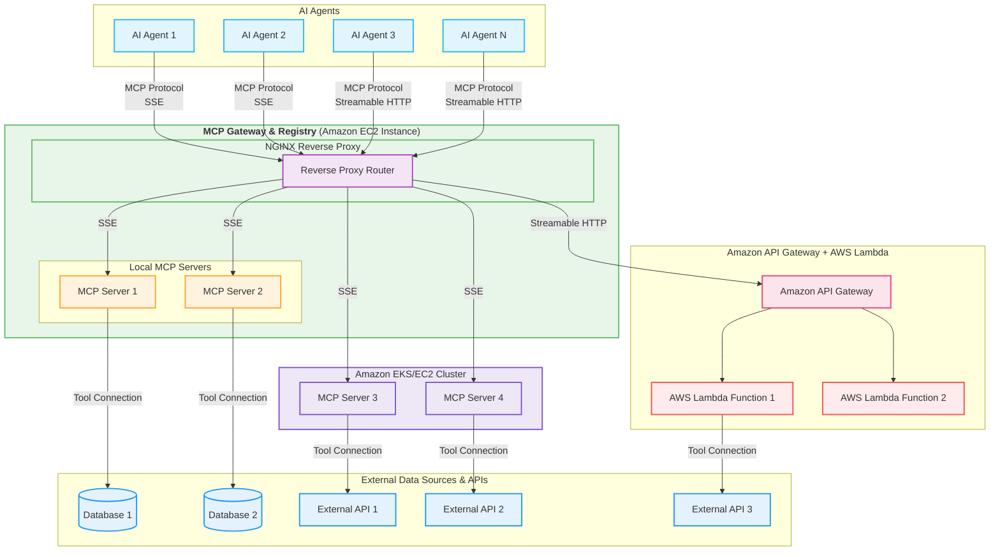
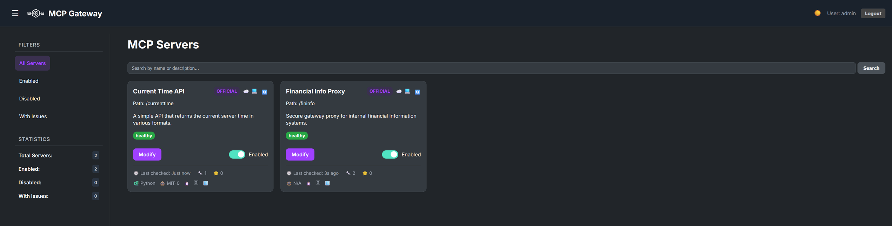

# ⚠️ ACTIVE DEVELOPMENT - WORK IN PROGRESS ⚠️

> **WARNING**: This repository is under active development. Expect frequent updates and breaking changes as we improve functionality and refine APIs. We recommend pinning to specific versions for production use. Star the repository to track our progress!


# MCP Gateway & Registry

[Model Context Protocol (MCP)](https://modelcontextprotocol.io/introduction) is an open standard protocol that allows AI Models to connect with external systems, tools, and data sources. A common problem that enterprises face while using MCP servers is that there is a need for a central point of access to a curated list of MCP servers and a catalog of such servers. This is the precise problem that this application provides a solution for by implementing an **MCP Gateway & Registry**. 


## Architecture

The Gateway works by using an [Nginx server](https://docs.nginx.com/nginx/admin-guide/web-server/reverse-proxy/) as a reverse proxy, where each MCP server is handled as a different _path_ and the Nginx reverse proxy sitting between the MCP clients (contained in AI Agents for example) and backend server forwards client requests to appropriate backend servers and returns the responses back to clients. The requested resources are then returned to the client.

The MCP Gateway provides a single endpoint to access multiple MCP servers and the Registry provides discoverability and management functionality for the MCP servers that an enterprise wants to use. An AI Agent written in any framework can connect to multiple MCP servers via this gateway, for example to access two MCP servers one called `weather`,  and another one called `currenttime` and agent would create an MCP client pointing `https://my-mcp-gateway.enterprise.net/weather/` and another one pointing to `https://my-mcp-gateway.enterprise.net/currenttime/`.  **This technique is able to support both SSE and Streamable HTTP transports**. 



## Features

*   **Service Registration:** Register MCP services via JSON files or the web UI/API.
*   **Web UI:** Manage services, view status, and monitor health through a web interface.
*   **Authentication:** Secure login system for the web UI and API access.
*   **Health Checks:**
    *   Periodic background checks for enabled services (checks `/sse` endpoint).
    *   Manual refresh trigger via UI button or API endpoint.
*   **Real-time UI Updates:** Uses WebSockets to push health status, tool counts, and last-checked times to all connected clients.
*   **Dynamic Nginx Configuration:** Generates an Nginx reverse proxy configuration file (`registry/nginx_mcp_revproxy.conf`) based on registered services and their enabled/disabled state.
*   **MCP Tool Discovery:** Automatically fetches and displays the list of tools (name, description, schema) for healthy services using the MCP client library.
*   **Service Management:**
    *   Enable/Disable services directly from the UI.
    *   Edit service details (name, description, URL, tags, etc.).
*   **Filtering & Statistics:** Filter the service list in the UI (All, Enabled, Disabled, Issues) and view basic statistics.
*   **UI Customization:**
    *   Dark/Light theme toggle (persisted in local storage).
    *   Collapsible sidebar (state persisted in local storage).
*   **State Persistence:** Enabled/Disabled state is saved to `registry/server_state.json` (and ignored by Git).

## Prerequisites

*   An Amazon EC2 machine for running this solution.
*   An SSL cert for securing the communication to the Gateway. _This Gateway uses a self-signed cert by default and is also available over HTTP_. 
*   One of the example MCP servers packaged in this repo uses the [`Polygon`](https://polygon.io/stocks) API for stock ticker data. Get an API key from [here](https://polygon.io/dashboard/signup?redirect=%2Fdashboard%2Fkeys). The server will still start without the API key but you will get a 401 Unauthorized error when using the tools provided by this server.

## Installation

The Gateway and the Registry are available as a Docker container. The package includes a couple of test MCP servers as well.

1.  **Clone the repository:**
    ```bash
    git clone https://github.com/aarora79/mcp-gateway.git
    cd mcp-gateway
    ```

1. **Build the Docker container to run the Gateway and Registry:**

    ```bash
    docker build -t mcp-gateway .

    ```

1. **Run the container:**

    ```bash
    # environment variables
    export ADMIN_USER=admin
    export ADMIN_PASSWORD=your-admin-password
    export POLYGON_API_KEY=your-polygon-api-key
    # stop any previous instance
    docker stop mcp-gateway-container && docker rm mcp-gateway-container 
    docker run -p 80:80 -p 443:443 -p 7860:7860 \
    -e ADMIN_USER=$ADMIN_USER \
    -e ADMIN_PASSWORD=$ADMIN_PASSWORD \
    -e POLYGON_API_KEY=$POLYGON_API_KEY \
    -e SECRET_KEY=$(python3 -c 'import secrets; print(secrets.token_hex(32))') \
    --name mcp-gateway-container mcp-gateway
    ```

    You should see some of the following traces show up on the screen (the following is an excerpt, some traces have been omitted for clarity).

    ```bash
    Setting up Registry environment (/app/registry/.env)...
    Registry .env created.
    SECRET_KEY=***********************************
    ADMIN_USER=admin
    ADMIN_PASSWORD=************************************
    Setting up Fininfo server environment (/app/servers/fininfo/.env)...
    Fininfo .env created.
    POLYGON_API_KEY=oN7dCYnQLIGMN1uCrHFpjX4YluM0EKTp
    Copying custom Nginx configuration...
    Nginx configuration copied to /etc/nginx/conf.d/nginx_rev_proxy.conf.
    Starting example MCP servers in the background...
    MCP servers start command issued.
    Processing directory: servers/current_time (port: 8001)
    Setting up Python environment...
    Using CPython 3.12.10 interpreter at: /usr/local/bin/python3.12
    Creating virtual environment at: .venv
    Installing requirements...
    Resolved 24 packages in 103ms
    Prepared 4 packages in 31ms
    Installed 24 packages in 740ms
    Starting server on port 8001...
    Server started with PID: 46
    -----------------------------------
    Processing directory: servers/fininfo (port: 8002)
    Setting up Python environment...
    Using CPython 3.12.10 interpreter at: /usr/local/bin/python3.12
    Creating virtual environment at: .venv
    Downloading pydantic-core (1.9MiB)
    Downloading pydantic-core
    Uninstalled 4 packages in 31ms
    Installed 4 packages in 6ms
    Installing requirements...
    Resolved 24 packages in 22ms
    Installed 24 packages in 14ms
    Starting server on port 8002...
    Server started with PID: 93
    -----------------------------------
    All servers have been started.
    To stop the servers, use: kill $(ps aux | grep 'python server.py' | grep -v grep | awk '{print $2}')
    Uninstalled 4 packages in 4ms
    Installed 4 packages in 4ms
    INFO:     Started server process [67]
    INFO:     Waiting for application startup.
    INFO:     Application startup complete.
    INFO:     Uvicorn running on http://0.0.0.0:8001 (Press CTRL+C to quit)
    INFO:     Started server process [104]
    INFO:     Waiting for application startup.
    INFO:     Application startup complete.
    INFO:     Uvicorn running on http://0.0.0.0:8002 (Press CTRL+C to quit)
    Starting MCP Registry in the background...
    MCP Registry start command issued.
    warning: Ignoring existing virtual environment linked to non-existent Python interpreter: /app/.venv/bin/python3 -> python
    Using CPython 3.12.10 interpreter at: /usr/local/bin/python3
    Removed virtual environment at: /app/.venv
    Creating virtual environment at: /app/.venv
    Downloading uvloop (4.5MiB)
    Downloading pydantic-core (1.9MiB)
    Downloading pydantic-core
    Downloading uvloop
    Installed 30 packages in 11ms
    INFO:     Started server process [132]
    INFO:     Waiting for application startup.
    Running startup tasks...
    Loading server definitions from /app/registry/servers...
    Successfully loaded 2 servers from individual files.
    Attempting to load persisted state from /app/registry/server_state.json...
    Successfully loaded persisted state.
    Final initial mock state: {'/fininfo': True, '/currenttime': True}
    Initialized health status based on loaded state: {'/fininfo': 'checking', '/currenttime': 'checking'}
    Performing initial health checks for enabled services...
    Initially enabled services to check: ['/fininfo', '/currenttime']
    INFO:     127.0.0.1:40100 - "HEAD /sse HTTP/1.1" 200 OK
    INFO:     127.0.0.1:54230 - "HEAD /sse HTTP/1.1" 200 OK
    Health check successful for /fininfo (http://localhost:8002/).
    Service /fininfo transitioned to healthy. Regenerating Nginx config and fetching tool list...
    Regenerating Nginx config at /app/registry/nginx_mcp_revproxy.conf...
    Nginx config regeneration successful.
    Attempting to connect to MCP server at http://localhost:8002/sse to get tool list...
    Health check successful for /currenttime (http://0.0.0.0:8001/).
    Service /currenttime transitioned to healthy. Regenerating Nginx config and fetching tool list...
    Regenerating Nginx config at /app/registry/nginx_mcp_revproxy.conf...
    Nginx config regeneration successful.
    Attempting to connect to MCP server at http://0.0.0.0:8001/sse to get tool list...
    INFO:     127.0.0.1:54242 - "GET /sse HTTP/1.1" 200 OK
    INFO:     127.0.0.1:40116 - "GET /sse HTTP/1.1" 200 OK
    INFO:     127.0.0.1:54250 - "POST /messages/?session_id=3ada448e17694085b4d18dc4600c220d HTTP/1.1" 202 Accepted
    INFO:     127.0.0.1:40124 - "POST /messages/?session_id=67446b6b8639446d8e0b6f7cba19614e HTTP/1.1" 202 Accepted
    INFO:     127.0.0.1:54250 - "POST /messages/?session_id=3ada448e17694085b4d18dc4600c220d HTTP/1.1" 202 Accepted
    INFO:     127.0.0.1:40124 - "POST /messages/?session_id=67446b6b8639446d8e0b6f7cba19614e HTTP/1.1" 202 Accepted
    INFO:     127.0.0.1:40124 - "POST /messages/?session_id=67446b6b8639446d8e0b6f7cba19614e HTTP/1.1" 202 Accepted
    INFO:     127.0.0.1:54250 - "POST /messages/?session_id=3ada448e17694085b4d18dc4600c220d HTTP/1.1" 202 Accepted
    Processing request of type ListToolsRequest
    Processing request of type ListToolsRequest
    Successfully retrieved details for 2 tools from http://localhost:8002/sse.
    Successfully retrieved details for 1 tools from http://0.0.0.0:8001/sse.
    Tool list for /fininfo remains unchanged. No update needed.
    Final health status for /fininfo: healthy
    Tool list for /currenttime remains unchanged. No update needed.
    Final health status for /currenttime: healthy
    Initial health check completed for /fininfo: Status = healthy
    Initial health check completed for /currenttime: Status = healthy
    Initial health status after checks: {'/fininfo': 'healthy', '/currenttime': 'healthy'}
    Generating initial Nginx configuration...
    Regenerating Nginx config at /app/registry/nginx_mcp_revproxy.conf...
    Nginx config regeneration successful.
    Starting background health check task...
    Running periodic health checks (Interval: 300s)...
    Performing periodic check for enabled service: /fininfo
    Setting status to 'checking' for /fininfo (http://localhost:8002/)...
    INFO:     Application startup complete.
    INFO:     Uvicorn running on http://0.0.0.0:7860 (Press CTRL+C to quit)
    INFO:     127.0.0.1:40132 - "HEAD /sse HTTP/1.1" 200 OK
    Health check successful for /fininfo (http://localhost:8002/).
    Final health status for /fininfo: healthy
    Performing periodic check for enabled service: /currenttime
    Setting status to 'checking' for /currenttime (http://0.0.0.0:8001/)...
    INFO:     127.0.0.1:54256 - "HEAD /sse HTTP/1.1" 200 OK
    Health check successful for /currenttime (http://0.0.0.0:8001/).
    Final health status for /currenttime: healthy
    Finished periodic health checks. Current status map: {'/fininfo': 'healthy', '/currenttime': 'healthy'}
    No status changes detected in periodic check, skipping broadcast.
    Starting Nginx in the background...
    Nginx started. Keeping container alive...

    ```

1. **Navigate to [`http://localhost:7860`](http://localhost:7860) access the Registry**

    


## Usage

1.  **Login:** Use the `ADMIN_USER` and `ADMIN_PASSWORD` from your `.env` file.
2.  **Register Service:** Use the "Register New Service" form in the UI (or the API).
3.  **Manage Services:**
    *   Toggle the Enabled/Disabled switch. The Nginx config automatically comments/uncomments the relevant `location` block.
    *   Click "Modify" to edit service details.
    *   Click the refresh icon (🔄) in the card header to manually trigger a health check and tool list update for enabled services.
4.  **View Tools:** Click the tool count icon (🔧) in the card footer to open a modal displaying discovered tools and their schemas for healthy services.
5.  **Filter:** Use the sidebar links to filter the displayed services.

### Steps to add a new MCP server to the Gateway and Registry

1. Option 1 (_recommended_): Use the `Register New Service` button the Registry UI. This will automatically create a JSON file for the new service, update the Nginx configuration file and reload the Nginx server.
1. Option 2: Use `/register` API (first call the `/login` API and not the secure cookie value), see steps in the [API endpoints](#api-endpoints-brief-overview) section.
1. Option 3: Manually add a JSON file for your service in the `registry/servers` directory and then restart the Registry process.  

## API Endpoints (Brief Overview)

*   `POST /register`: Register a new service (form data).
*   `POST /toggle/{service_path}`: Enable/disable a service (form data).
*   `POST /edit/{service_path}`: Update service details (form data).
*   `GET /api/server_details/{service_path}`: Get full details for a service (JSON).
*   `GET /api/tools/{service_path}`: Get the discovered tool list for a service (JSON).
*   `POST /api/refresh/{service_path}`: Manually trigger a health check/tool update.
*   `GET /login`, `POST /login`, `POST /logout`: Authentication routes.

*(Authentication via session cookie is required for most non-login routes)*

```bash
curl -X POST http://localhost:7860/register \
  -H "Content-Type: application/x-www-form-urlencoded" \
  -H "Cookie: mcp_gateway_session=..." \
  --data-urlencode "name=My New Service" \
  --data-urlencode "description=A fantastic new service" \
  --data-urlencode "path=/new-service" \
  --data-urlencode "tags=new,experimental" \
  --data-urlencode "license=MIT" \
  --data-urlencode "is_python=true"
```

*(Remember to replace the cookie value)*

This will create a corresponding JSON file in `registry/servers/`. 

## Roadmap

1. Add OAUTH 2.1 support to example servers.
1. Use GitHub API to retrieve information (license, programming language etc.) about MCP servers.
1. Add option to deploy MCP servers.