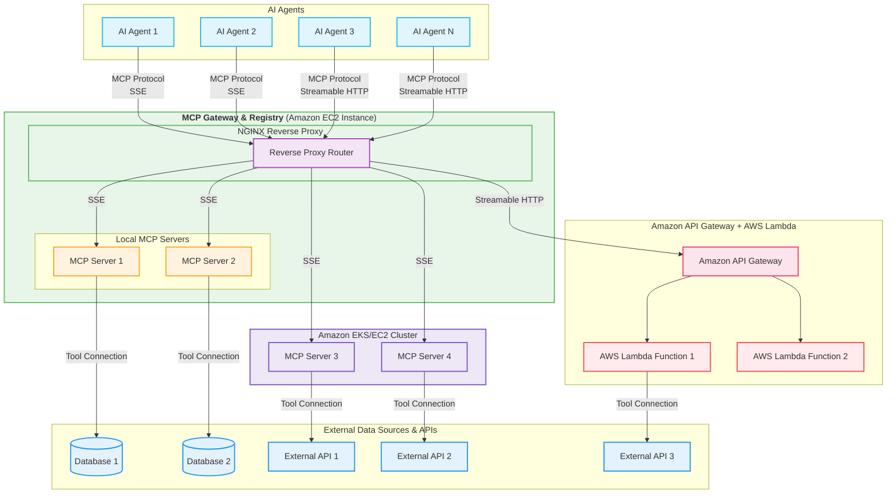

## Taming the Chaos: How the MCP Gateway Centralizes Your AI Model's Tools

---

### The Problem You Face: The Wild West of AI Tool Integration

The [Model Context Protocol (MCP)](https://modelcontextprotocol.io/introduction) is revolutionizing how AI models connect with the outside world – tools, databases, APIs, you name it. But as your AI capabilities grow, so does the number of MCP servers you rely on.

Suddenly, you're facing a new kind of complexity:

*   **Discoverability Nightmare:** Which MCP servers are available? What tools do they offer? Where are they running?
*   **Configuration Hell:** Each AI agent needs to be configured with multiple URLs for different MCP servers. Updating these becomes a chore.
*   **Management Overhead:** How do you track the health and status of all these independent servers? How do you enable or disable them consistently?
*   **Inconsistent Access:** Different teams might deploy or access servers in slightly different ways, leading to integration friction.

Managing a growing collection of disparate MCP servers feels like herding cats. It slows down development, increases the chance of errors, and makes scaling a headache.

---

### What Fixing It Changes: A Centralized, Discoverable, and Managed Ecosystem

Imagine a single, unified point of access for *all* your approved MCP servers. A central hub where:

*   **Discovery is Simple:** A clear catalog shows every registered MCP server, its purpose, and the tools it provides.
*   **Configuration is Unified:** AI agents connect to the *gateway* using predictable paths (e.g., `gateway.mycorp.com/weather`, `gateway.mycorp.com/fininfo`), not directly to scattered servers.
*   **Management is Centralized:** A web UI allows you to easily view the health, enable/disable, and even refresh the tool list of any registered server.
*   **Access is Standardized:** All MCP traffic (SSE and Streamable HTTP) flows through a consistent, managed entry point.

This is exactly what the **MCP Gateway & Registry** provides. It transforms your scattered MCP landscape into an organized, manageable, and scalable ecosystem.

---

### Clear Proof: Architecture & Features of the MCP Gateway

The MCP Gateway isn't just an idea; it's a robust application built on proven technologies.

**Architecture:**

At its core, the Gateway uses **Nginx** as a powerful reverse proxy. A **FastAPI** application acts as the **Registry**, managing server information and providing a **Web UI**.

*   **Nginx Reverse Proxy:** Intelligently routes incoming MCP requests (based on the URL path like `/weather` or `/fininfo`) to the correct backend MCP server, wherever it might be running (locally, EKS, Lambda, etc.).
*   **FastAPI Registry:**
    *   Stores details of all registered MCP servers (name, description, URL, tags, etc.).
    *   Provides REST APIs for registration, management, and querying server details/tools.
    *   Serves the Web UI.
*   **Health Checks:** Periodically checks the `/sse` endpoint of registered and enabled servers to ensure they are responsive.
*   **Tool Discovery:** Connects to healthy servers using the MCP client library to fetch and display their available tools.
*   **WebSockets:** Pushes real-time status updates (health, tool counts) to the Web UI.

**(Diagram: Include the Mermaid diagram from the README here - Render as image for Medium)**

**(Caption:** High-level architecture of the MCP Gateway & Registry, routing requests from AI Agents to backend MCP Servers.)

**Key Features:**

*   **Centralized Proxy:** Single entry point for all MCP traffic.
*   **Service Registry & Discovery:** Find and understand available services.
*   **Web UI Management:** Easy-to-use interface for operators.
    *   **[Image Placeholder: Screenshot of the MCP Gateway Dashboard showing registered services, health status, and toggle switches.]**
*   **Real-time Health Monitoring:** Know the status of your services instantly via WebSocket updates.
*   **Dynamic Nginx Configuration:** Automatically updates routing rules as services are enabled/disabled.
*   **Automatic Tool Listing:** Fetches and displays tools from healthy services.
    *   **[Image Placeholder: Screenshot of the tool listing modal for a specific service.]**
*   **Secure Access:** Authentication for UI and management APIs.
*   **Flexible Deployment:** Runs in Docker, integrates with various backend hosting options.

---

### Simple Steps to Make It Happen: Getting Started

Setting up and using the MCP Gateway is straightforward:

1.  **Deploy the Gateway:** Build and run the provided Docker container (see `README.md` for detailed instructions). Configure admin credentials and any necessary API keys (like Polygon).
2.  **Access the UI:** Navigate to the Gateway's host (e.g., `http://localhost:7860`) and log in.
3.  **Register Your Services:** Use the UI or the `/register` API endpoint to add your existing MCP servers, providing their name, path prefix (e.g., `/weather`), and internal URL (e.g., `http://weather-service:8000`).
    *   **[Image Placeholder: Screenshot of the 'Register Service' form or API call example.]**
4.  **Configure AI Agents:** Update your AI agents' MCP client configurations to point to the Gateway URLs (e.g., `https://my-gateway.com/weather/`, `https://my-gateway.com/fininfo/`).
5.  **Manage and Monitor:** Use the Web UI to monitor health, toggle services, and see available tools.

---

### Our Promise to You: Simplicity, Scalability, and Control

The MCP Gateway & Registry isn't just another piece of infrastructure; it's a promise to simplify your AI development workflow.

*   **Reduced Complexity:** Abstract away the underlying locations of your MCP servers.
*   **Improved Discoverability:** Make it easy for developers and agents to find the tools they need.
*   **Enhanced Control:** Manage the availability and health of your critical AI tools from one place.
*   **Increased Productivity:** Spend less time configuring and debugging connections, and more time building intelligent applications.

This project is actively developed, aiming to be the de facto standard for managing enterprise MCP deployments.

---

### Take Control of Your MCP Ecosystem

Ready to move beyond the chaos of scattered MCP servers?

*   **Check out the code:** [Link to your GitHub Repository]
*   **Try it out:** Follow the installation steps in the README.
*   **Contribute:** We welcome feedback and contributions!

Stop wrestling with complexity and start leveraging the power of a unified MCP landscape with the MCP Gateway & Registry.

**(Optional: Call to action buttons/links if Medium allows)** 