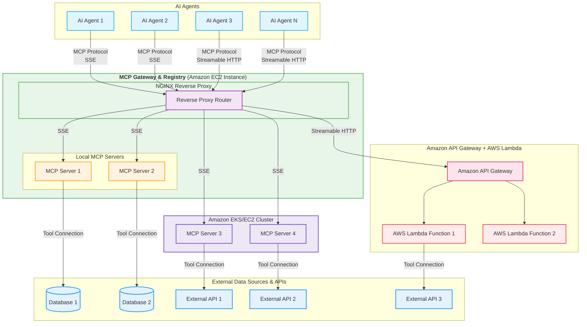

## Taming the Chaos: How the MCP Gateway Centralizes Your AI Model's Tools


---

### The Problem You Face: The Wild West of AI Tool Integration

The [Model Context Protocol (MCP)](https://modelcontextprotocol.io/introduction) is revolutionizing how AI models connect with the outside world – tools, databases, APIs, you name it. As enterprises adopt this protocol, they quickly discover that their AI capabilities expand exponentially, but so does the complexity of managing the growing ecosystem of MCP servers they rely on.

For CTOs and technical leaders, this presents a strategic challenge: how do you maintain control and visibility over a rapidly expanding network of AI capabilities? For developers, it creates a practical challenge: how do you efficiently discover, connect to, and utilize the right tools for your AI applications?

Suddenly, you're facing a new kind of complexity:

*   **Discoverability Nightmare:** Which MCP servers are available in your organization? What tools do they offer? Where are they running? How do you find the right tool for a specific task?
*   **Configuration Hell:** Each AI agent needs to be configured with multiple URLs for different MCP servers. Updating these becomes a time-consuming chore that introduces risk with each change.
*   **Management Overhead:** How do you track the health and status of all these independent servers? How do you enable or disable them consistently? How do you ensure they're properly authenticated and secured?
*   **Inconsistent Access:** Different teams might deploy or access servers in slightly different ways, leading to integration friction, duplicated efforts, and inconsistent implementation patterns.
*   **Scaling Challenges:** As your AI capabilities grow, how do you ensure your infrastructure can scale without introducing bottlenecks or single points of failure?

Managing a growing collection of disparate MCP servers feels like herding cats. It slows down development, increases the chance of errors, and makes scaling a headache. For organizations serious about AI, this challenge can become a significant barrier to innovation.

---

### What Fixing It Changes: A Centralized, Discoverable, and Managed Ecosystem

Imagine a single, unified point of access for *all* your approved MCP servers. A central hub where:

*   **Discovery is Simple:** A clear catalog shows every registered MCP server, its purpose, and the tools it provides. Developers can browse available tools and quickly find what they need.
*   **Configuration is Unified:** AI agents connect to the *gateway* using predictable paths (e.g., `gateway.mycorp.com/weather`, `gateway.mycorp.com/fininfo`), not directly to scattered servers. This abstraction layer shields your applications from underlying infrastructure changes.
*   **Management is Centralized:** A web UI allows you to easily view the health, enable/disable, and even refresh the tool list of any registered server. Operations teams gain visibility and control over the entire ecosystem.
*   **Access is Standardized:** All MCP traffic (SSE and Streamable HTTP) flows through a consistent, managed entry point, enabling standardized authentication, logging, and monitoring.
*   **Governance is Simplified:** Security teams can implement consistent access controls, audit trails, and compliance measures across all MCP servers through a single interface.

This is exactly what the **MCP Gateway & Registry** provides. It transforms your scattered MCP landscape into an organized, manageable, and scalable ecosystem that aligns with enterprise requirements for governance, reliability, and operational efficiency.

---

### Architecture & Features of the MCP Gateway

The MCP Gateway isn't just an idea; it's a robust application built on proven technologies designed for enterprise-grade reliability and performance.

**Architecture:**



**(Caption:** High-level architecture of the MCP Gateway & Registry, routing requests from AI Agents to backend MCP Servers.)

At its core, the Gateway uses **Nginx** as a powerful reverse proxy. A **FastAPI** application acts as the **Registry**, managing server information and providing a **Web UI**. This architecture separates concerns effectively, allowing each component to focus on what it does best.

*   **Nginx Reverse Proxy:** Intelligently routes incoming MCP requests (based on the URL path like `/weather` or `/fininfo`) to the correct backend MCP server, wherever it might be running (locally, EKS, Lambda, etc.). This provides:
    *   High-performance request routing with minimal latency
    *   Ability to handle thousands of concurrent connections
    *   Built-in load balancing capabilities for high availability
    *   Support for both HTTP and HTTPS traffic with proper SSL termination

*   **FastAPI Registry:**
    *   Stores details of all registered MCP servers (name, description, URL, tags, etc.) in a structured format
    *   Provides comprehensive REST APIs for registration, management, and querying server details/tools
    *   Implements proper authentication and session management for secure access
    *   Serves the Web UI with real-time updates via WebSockets
    *   Handles dynamic Nginx configuration generation based on server state changes

*   **Health Checks:** Periodically checks the `/sse` endpoint of registered and enabled servers to ensure they are responsive. The system:
    *   Runs background tasks that verify server availability at configurable intervals
    *   Updates server status in real-time when changes are detected
    *   Provides detailed error information when servers become unhealthy
    *   Allows manual triggering of health checks for immediate verification

*   **Tool Discovery:** Connects to healthy servers using the MCP client library to fetch and display their available tools, including:
    *   Tool names, descriptions, and parameter schemas
    *   Automatic parsing and formatting of tool documentation
    *   Categorization based on server tags and tool functionality
    *   Searchable interface for finding specific capabilities

*   **WebSockets:** Pushes real-time status updates (health, tool counts) to the Web UI, enabling:
    *   Immediate visibility of server status changes without page refreshes
    *   Live monitoring of the entire MCP ecosystem from a single dashboard
    *   Efficient updates that minimize network traffic and browser resource usage

**Key Features:**

*   **Centralized Proxy:** Single entry point for all MCP traffic, simplifying network architecture and security management.
*   **Service Registry & Discovery:** Find and understand available services through a comprehensive catalog with detailed metadata.
*   **Web UI Management:** Easy-to-use interface for operators with intuitive controls for common management tasks.
    *   **[Image Placeholder: Screenshot of the MCP Gateway Dashboard showing registered services, health status, and toggle switches.]**
*   **Real-time Health Monitoring:** Know the status of your services instantly via WebSocket updates, with detailed diagnostics for troubleshooting.
*   **Dynamic Nginx Configuration:** Automatically updates routing rules as services are enabled/disabled, eliminating manual configuration errors.
*   **Automatic Tool Listing:** Fetches and displays tools from healthy services, providing a complete inventory of available capabilities.
    *   **[Image Placeholder: Screenshot of the tool listing modal for a specific service.]**
*   **Secure Access:** Authentication for UI and management APIs, with session management and proper security controls.
*   **Flexible Deployment:** Runs in Docker, integrates with various backend hosting options including EC2, EKS, Lambda, and more.
*   **Filtering & Statistics:** Filter services by status (All, Enabled, Disabled, Issues) and view usage statistics for better resource management.
*   **UI Customization:** Support for dark/light themes and collapsible sidebar, with state persistence for user preferences.

---

### Self-Management Through MCP: The Gateway's Own MCP Server

One of the most powerful features of the MCP Gateway is its ability to manage itself through the MCP protocol. We've created a dedicated MCP server (`mcpgw`) that exposes the Gateway's management capabilities as MCP tools, enabling AI agents to interact with and manage the Gateway directly.

This meta-capability allows for powerful automation scenarios:

*   **AI-Driven Management:** AI agents like Cursor can monitor and interact with the registry, enabling natural language management of your MCP ecosystem.
*   **Programmatic Control:** Developers can use standard MCP clients to register new services, toggle existing ones, or retrieve tool information.
*   **Self-Documentation:** The Gateway exposes its own capabilities through the same protocol it manages, creating a consistent interface pattern.

The `mcpgw` server provides these key tools:

*   **`toggle_service`:** Enable or disable registered MCP servers with a simple API call.
*   **`register_service`:** Add new MCP servers to the Gateway programmatically.
*   **`get_server_details`:** Retrieve configuration information about registered servers.
*   **`get_service_tools`:** List all tools provided by a specific server or all servers.
*   **`refresh_service`:** Trigger a manual refresh of a server's health status and tool list.
*   **`healthcheck`:** Get real-time health information for all registered servers.

This self-referential design creates a powerful ecosystem where the Gateway can be managed through the same protocol it facilitates, enabling sophisticated automation and integration scenarios.

---

### Simple Steps to Make It Happen: Getting Started

Setting up and using the MCP Gateway is straightforward, designed for both quick proof-of-concept deployments and production-ready implementations:

1.  **Deploy the Gateway:** Build and run the provided Docker container (see `README.md` for detailed instructions). Configure admin credentials and any necessary API keys (like Polygon for the included financial information server).
    ```bash
    docker build -t mcp-gateway .
    docker run -p 80:80 -p 443:443 -p 7860:7860 \
      -e ADMIN_USER=admin \
      -e ADMIN_PASSWORD=your-secure-password \
      -e SECRET_KEY=$(python3 -c 'import secrets; print(secrets.token_hex(32))') \
      -v /var/log/mcp-gateway:/app/logs \
      -v /opt/mcp-gateway/servers:/app/registry/servers \
      --name mcp-gateway-container mcp-gateway
    ```

2.  **Access the UI:** Navigate to the Gateway's host (e.g., `http://localhost:7860`) and log in with your configured credentials.

    

3.  **Register Your Services:** Use the UI or the `/register` API endpoint to add your existing MCP servers, providing their name, path prefix (e.g., `/weather`), and internal URL (e.g., `http://weather-service:8000`).
    
    Alternatively, use the `mcpgw` MCP server to register services programmatically:
    ```python
    # Example using the MCP client to register a new service
    result = await session.call_tool(
        "register_service", arguments={
            "server_name": "Weather Service",
            "path": "/weather",
            "proxy_pass_url": "http://weather-service:8000",
            "description": "Provides weather forecasts and historical data",
            "tags": ["weather", "forecast", "climate"],
            "username": "admin",
            "password": "your-secure-password"
        }
    )
    ```

4.  **Configure AI Agents:** Update your AI agents' MCP client configurations to point to the Gateway URLs (e.g., `https://my-gateway.com/weather/`, `https://my-gateway.com/fininfo/`). This single change abstracts away all the underlying infrastructure details.

5.  **Manage and Monitor:** Use the Web UI to monitor health, toggle services, and see available tools. The real-time updates via WebSockets ensure you always have the current status of your MCP ecosystem.

---

### Our Promise to You: Simplicity, Scalability, and Control

The MCP Gateway & Registry isn't just another piece of infrastructure; it's a strategic investment in your AI development workflow and operational efficiency.

For CTOs and technical leaders:
*   **Governance and Visibility:** Gain a complete view of your organization's AI capabilities and how they're being utilized.
*   **Risk Reduction:** Centralize authentication, access control, and monitoring to enhance security posture.
*   **Resource Optimization:** Understand usage patterns and allocate resources more effectively based on actual demand.
*   **Future-Proofing:** Create an architecture that can scale with your AI ambitions without requiring constant redesign.

For developers and engineers:
*   **Reduced Complexity:** Abstract away the underlying locations and implementation details of MCP servers.
*   **Improved Discoverability:** Quickly find the tools you need through a searchable, categorized interface.
*   **Enhanced Productivity:** Spend less time configuring and debugging connections, and more time building intelligent applications.
*   **Consistent Experience:** Work with a standardized interface regardless of where the underlying tools are deployed.

This project is actively developed, with a clear roadmap that includes:
1. Persistent storage for server information
2. OAUTH 2.1 support for enhanced security
3. GitHub API integration for retrieving server metadata
4. Deployment automation for MCP servers

Our goal is to establish the MCP Gateway & Registry as the de facto standard for managing enterprise MCP deployments, providing a foundation that grows with your AI capabilities.

---

### Take Control of Your MCP Ecosystem

Ready to move beyond the chaos of scattered MCP servers and embrace a more organized, manageable approach to AI tool integration?

*   **Check out the code:** [MCP Gateway repo on GitHub](https://github.com/aarora79/mcp-gateway/tree/main)
*   **Try it out:** Follow the installation steps in the [README](https://github.com/aarora79/mcp-gateway/tree/main?tab=readme-ov-file#installation) to deploy your own Gateway in minutes.
*   **Contribute:** We welcome feedback, feature requests, and code contributions from the community! Create a GitHub issue, see [guidelines for contributing](https://github.com/aarora79/mcp-gateway/blob/main/startCONTRIBUTING.md).
*   **Connect:** Join our community of AI practitioners who are building the future of AI tool integration.

Stop wrestling with complexity and start leveraging the power of a unified MCP landscape with the MCP Gateway & Registry. Your AI infrastructure deserves this level of organization and control.

